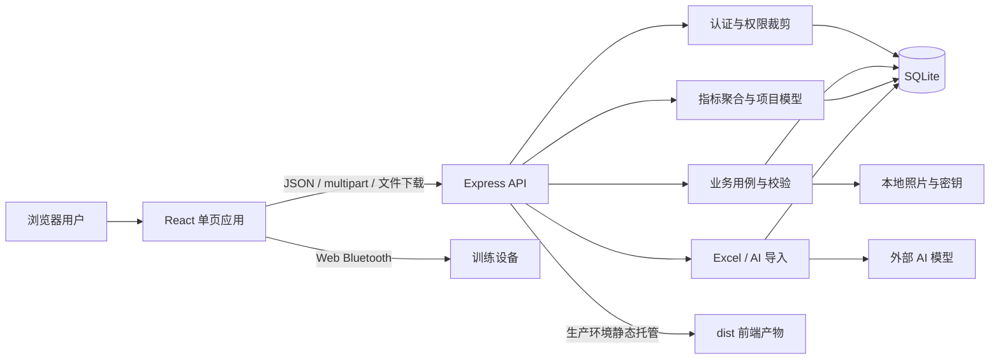
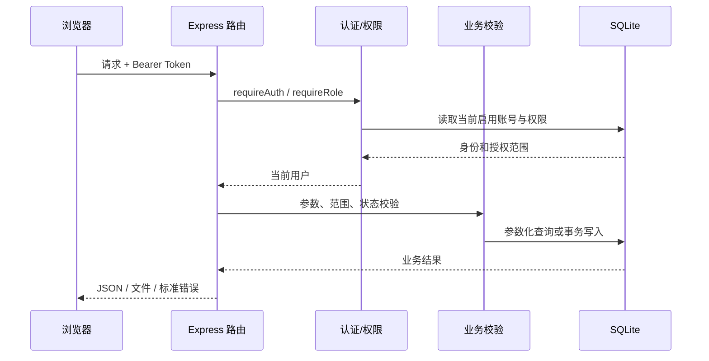
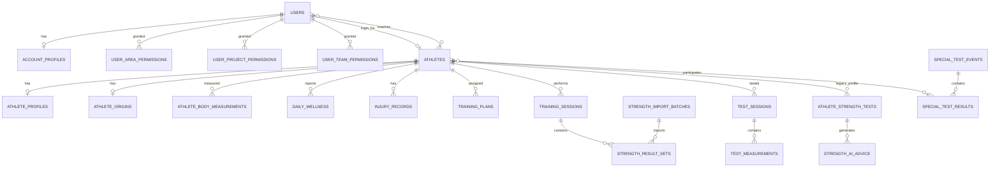

# 竞迹系统架构

> 本文描述当前代码库的实际架构、模块边界、核心数据流和演进约束。
>
> 基准日期：2026-09-02。若本文与代码不一致，以代码和数据库迁移结果为准，并应同步修订本文。

## 1. 系统定位与边界

竞迹是面向赛艇、皮划艇和激流项目的训练监控与运动员管理平台。系统围绕运动员建立组织权限、专项训练、体能训练、测试评估、伤病恢复和训练分析能力。

当前代码库交付一个网页应用和一个同进程 API 服务：

- 浏览器端负责登录、页面编排、交互编辑、图表展示和文件下载；
- API 服务负责身份认证、权限裁剪、业务校验、数据聚合、文件导入、AI 调用和 Excel 生成；
- SQLite 保存业务数据；
- 本地文件系统保存运动员照片、JWT 密钥和数据库文件；
- 外部兼容 OpenAI Chat Completions 协议的模型用于生成体能训练和识别训练结果；
- Web Bluetooth 直接运行在浏览器内，目前不经过 API，也不写入业务数据库。

以下内容不属于当前稳定架构边界：

- `dist/` 是构建产物，不是源代码；
- `data/`、`tmp/` 中的运行时数据不应被当成程序定义；
- `miniprogram/` 当前没有纳入 Git 的业务源文件，仅有本地产物和依赖，不视为已交付的小程序架构；
- 浏览器蓝牙页目前是设备通信试验入口，不是正式的数据采集管道。

## 2. 架构总览



系统采用模块化单体形态：前端、API、数据库访问和分析模型位于同一仓库，生产环境由一个 Node.js 进程提供 API、上传文件和前端静态资源。

## 3. 运行拓扑

### 3.1 开发环境

```text
浏览器 :5173
   │
   ├── Vite 提供前端与热更新
   └── /api 代理到 Express :8787

Express :8787
   ├── SQLite：data/training-monitor.db
   ├── 照片：data/uploads/athlete-photos/
   └── JWT 密钥：环境变量或 data/.jwt-secret
```

`npm run dev` 由 `server/dev.ts` 同时启动 Vite 与 `tsx watch server/index.ts`，并在启动前检查 5173、8787 端口是否可用。

### 3.2 生产环境

`npm run build` 先执行 TypeScript 项目构建，再由 Vite 生成 `dist/`。`npm run start` 启动 `server/index.ts`：

1. `/api/*` 由 Express 处理；
2. `/uploads/athlete-photos/*` 提供运动员照片；
3. 存在 `dist/` 时由 Express 托管静态资源；
4. 非 API 路径回退到 `dist/index.html`，支持单页应用刷新。

生产部署通常在 Express 前增加 HTTPS 反向代理。数据库、上传目录和 JWT 密钥必须纳入备份。

## 4. 仓库结构与职责

```text
jingji/
├─ src/                    # React 浏览器端
│  ├─ App.tsx              # 会话、全局筛选、页面状态和页面装配
│  ├─ api.ts               # 浏览器端唯一 API 访问门面
│  ├─ types.ts             # 前端传输对象和页面模型
│  ├─ pages/               # 页面级功能模块
│  ├─ components/          # 跨页面组件与分析视图
│  ├─ overview-analytics.ts# 浏览器侧兼容分析计算
│  └─ pdf/                 # 浏览器端 PDF 导出
├─ server/
│  ├─ index.ts             # Express 入口、路由、用例、权限和导入流程
│  ├─ db.ts                # SQLite 连接、表结构、迁移和初始化数据
│  ├─ overview-service.ts  # 训练总览统一查询与聚合
│  ├─ ai-service.ts        # 体能训练生成
│  ├─ strength-import-ai.ts# PDF/图片体能结果识别
│  └─ dev.ts               # 本地双进程开发编排
├─ shared/                 # 前后端共享的稳定领域定义
│  ├─ access.ts            # 角色和区域层级
│  ├─ projects.ts          # 项目字典
│  ├─ regions.ts           # 行政区域字典
│  ├─ coach-categories.ts  # 教练分类
│  ├─ strength-model.ts    # 体能测试指标定义
│  ├─ strength-training.ts # 体能训练分类和推断规则
│  ├─ overview-metrics.ts  # 总览指标字典
│  ├─ rowing-model.ts      # 赛艇分析规则
│  ├─ canoe-model.ts       # 皮划艇分析规则
│  └─ slalom-model.ts      # 激流及冠军模型规则
├─ public/                 # 品牌资源、人体图和下载模板
├─ scripts/                # API、功能和视觉回归检查
├─ deploy/                 # Nginx、发布和维护脚本
└─ data/                   # 本地运行数据，非源代码
```

## 5. 前端架构

### 5.1 应用装配

前端是 React 单页应用，没有使用 URL 路由库。`App.tsx` 用 `PageKey` 状态选择页面，并通过 `React.lazy` 按页面延迟加载。

`App.tsx` 持有跨页面共享状态：

- 当前用户；
- 当前项目；
- 可访问运动员列表；
- 当前运动员；
- 日期范围；
- 当前训练记录；
- 刷新版本和全局错误。

页面切换不会改变浏览器 URL。需要可分享链接、前进后退或页面级深链时，应先引入显式路由设计，而不是继续扩展 `PageKey` 条件分支。

### 5.2 导航域

当前导航按业务域组织：

| 导航域 | 页面/子页面 | 主要数据源 |
|---|---|---|
| 训练总览 | 团队或运动员总览 | `/api/overview`、测试及训练记录 |
| 专项训练 | 专项分析、专项指标、训练安排、运动员看板 | 训练场次、专项测试、设备指标 |
| 体能训练 | 体能总览、训练安排、训练记录、训练分析、体能评估 | 训练计划、体能结果、力量测试 |
| 数据采集 | 蓝牙连接 | 浏览器 Web Bluetooth |
| 个人档案 | 个人画像、身体成分、伤病、测试与报告 | 多个运动员级接口 |
| 组织管理 | 运动员、教练、队伍、权限、账户审核 | 管理类接口 |

运动员账号只能看到本人相关功能；管理账号的菜单按角色过滤。菜单过滤只负责用户体验，不能替代服务端授权。

### 5.3 API 边界

`src/api.ts` 是浏览器端访问服务端的统一门面：

- 自动附加 Bearer Token；
- 统一 JSON 请求和错误消息；
- 封装 multipart 上传；
- 封装 Excel 文件下载；
- 返回 `src/types.ts` 中定义的传输对象。

页面和组件不应自行拼接新的 `/api` 请求。新增接口应先进入 `api.ts`，以保持认证、错误处理和类型边界一致。

### 5.4 前端计算职责

原则上，权限、数据范围和关键业务结论由服务端决定。前端可以负责：

- 图表所需的展示变换；
- 已获取数据的交互筛选；
- 未保存表单的即时计算；
- 兼容性分析和视觉布局。

前端不得作为以下规则的唯一实现位置：

- 用户是否有权访问某名运动员；
- 指标值是否合法；
- 导入数据是否可入库；
- 账号能否管理另一个账号；
- AI 结果是否可以直接成为正式数据。

## 6. 服务端架构

### 6.1 请求处理链



### 6.2 服务端职责划分

- `server/index.ts`：HTTP 适配、认证、权限、输入校验、事务用例、导入缓存、Excel 输出；
- `server/db.ts`：连接参数、表结构、兼容迁移、初始化锁和初始化数据；
- `server/overview-service.ts`：以训练场次为中心构建总览结果；
- `server/ai-service.ts`：收集运动员上下文、按优先级调用模型并解析训练计划；
- `server/strength-import-ai.ts`：把图片/PDF识别为逐组体能训练结果。

当前 `server/index.ts` 同时承担路由、领域服务、仓储查询和文件处理，属于可工作的单体入口，但已经形成明显的“大文件边界”。新增较大功能时，应按业务域拆出路由和服务，而不是继续向入口文件堆叠逻辑。

### 6.3 API 业务域

| API 域 | 路径前缀 | 主要职责 |
|---|---|---|
| 认证与资料 | `/api/auth`、`/api/me`、`/api/profile` | 登录、注册、会话、改名、改密 |
| 偏好 | `/api/preferences` | 总览布局持久化 |
| 运动员 | `/api/athletes`、`/api/admin/athletes` | 档案、身体成分、照片、伤病、批量管理 |
| 队伍与人员 | `/api/teams`、`/api/admin/assignments`、`/api/admin/coaches` | 队伍目录、教练分类与绑定 |
| 专项训练 | `/api/special-training`、`/api/special-tests` | 训练场次、专项测试和模板导入 |
| 体能训练 | `/api/training-plans`、`/api/strength-training` | 计划、AI 生成、结果导入和分析 |
| 测试与模型 | `/api/strength-tests`、`/api/analysis`、冠军模型接口 | 测试、建议、项目模型和个人分析 |
| 总览与记录 | `/api/overview`、`/api/records` | 权限范围内的聚合和场次查询 |
| 组织治理 | `/api/admin/registrations`、`/api/access` | 审核、账号、授权和审计 |

## 7. 共享领域模型

`shared/` 是前后端共同依赖的领域语言层。它应只放无运行环境依赖、可确定性执行的定义和纯函数。

### 7.1 角色层级

```text
DMD 数据监控总监      level 5
  └─ TD 训练总监      level 4
      ├─ PRJ 项目负责人 level 3
      └─ REG 区域负责人 level 3
          └─ SCC 队伍体能教练 level 2
              └─ ATL 运动员 level 1
```

PRJ 与 REG 处于同一级，不能互相管理。上下级管理要求管理者角色级别严格高于目标角色。

### 7.2 项目模型

系统支持三个相互隔离的项目空间：

- 赛艇；
- 皮划艇；
- 激流。

项目决定运动员归属、导航筛选、导入校验、指标字典和分析模型。所有新增项目相关功能必须明确：

1. 是否是全项目通用；
2. 若非通用，适用哪些项目；
3. 缺失数据如何处理；
4. 固定阈值、个人基线和教练目标分别扮演什么角色。

### 7.3 体能训练分类

体能训练统一使用：

- 五类训练：基础力量、功能性体能、核心力量、专项力量、代谢训练；
- 身体位置：上肢、下肢、核心、全身；
- 环境：水上、陆上、测功仪、泳池、场馆、其他；
- 强度区：U3、U2、U1、AT、TPT、AN、ATP。

动作名称推断分类仅是兼容辅助。正式导入后应保存明确分类，不能长期依赖字符串正则推断。

## 8. 数据架构

### 8.1 数据库运行方式

数据库使用 Node.js 内置 `node:sqlite` 的同步接口 `DatabaseSync`，没有 ORM。

启动时设置：

- `busy_timeout = 15000`；
- 外键约束开启；
- WAL 日志模式；
- `synchronous = NORMAL`。

表结构、兼容迁移和初始化数据都在 `server/db.ts` 中执行。`app_metadata` 配合 `BEGIN IMMEDIATE` 保证带版本的初始化任务只运行一次。

这种方式适合单机和小规模试点；不应假定它天然支持多实例共享写入。迁移到 PostgreSQL 时，需要先抽离 SQL 方言、事务和初始化逻辑。

### 8.2 核心实体关系



### 8.3 数据域

| 数据域 | 核心表 | 说明 |
|---|---|---|
| 身份与组织 | `users`、`account_profiles`、权限表、`coach_athletes` | 身份、层级和数据范围 |
| 运动员主数据 | `athletes`、`athlete_profiles`、`athlete_origins` | 稳定身份和扩展档案 |
| 训练事实 | `training_sessions`、`daily_wellness`、`strength_result_sets` | 当前总览和记录页的主要事实源 |
| 训练计划 | `training_plans` | 结构化列与 `plan_data` JSON 并存 |
| 测试评估 | `test_sessions`、`test_measurements`、身体测量、竞技状态 | 统一指标模型 |
| 专项测试 | `special_test_events`、`special_test_results` | 事件与参与者成绩 |
| 健康 | `injury_records` | 疼痛、限制、康复与复查 |
| 导入与审计 | `strength_import_batches`、`audit_logs` | 数据来源和敏感操作追踪 |

### 8.4 当前双轨训练数据

代码中同时存在两套训练事实模型：

1. **新模型**：`training_sessions` + `daily_wellness` + `strength_result_sets`；
2. **旧模型**：`training_records`，包含训练与恢复的扁平字段。

当前调用关系并未完全统一：

- `/api/records` 和 `/api/overview` 主要读取新模型；
- 专项训练手工录入和体能结果导入写入新模型；
- 部分 `/api/analysis/summary` 和 AI 训练上下文仍读取旧模型。

这会造成同一运动员在不同页面或 AI 上下文中看到的数据不一致。架构演进的首要任务是确定 `training_sessions` 为唯一训练事实源，并完成以下迁移：

1. 旧记录回填到新模型；
2. 所有读路径切换到统一查询服务；
3. 对照验证聚合结果；
4. 停止写入和读取 `training_records`；
5. 最后移除旧表及兼容类型。

在迁移完成前，新增功能不得再直接依赖 `training_records`。

### 8.5 JSON 与结构化列

`training_plans.plan_data`、测试指标 JSON 和部分审计详情使用 JSON 保存可变结构。这允许训练矩阵快速演进，但也降低数据库查询、约束和迁移能力。

使用原则：

- 高频筛选、关联和聚合字段必须使用结构化列；
- 计划编辑器的完整快照可以保留 JSON；
- JSON 入库前必须经过服务端解析和规范化；
- JSON 结构变化必须有兼容读取逻辑或显式版本；
- 不应在多个页面各自解释同一 JSON 结构。

## 9. 权限架构

### 9.1 权限组成

数据访问不是简单 RBAC，而是角色与资源范围的组合：

```text
有效权限 = 角色能力
         ∩ 行政区域范围
         ∩ 项目范围
         ∩ 队伍范围
         ∩ 教练—运动员关系（教练角色）
```

区域范围支持全国、省、市、区县；项目和队伍支持明确值或通配范围。账号的权限不得超过其直属上级。

### 9.2 授权执行

服务端授权按以下顺序执行：

1. `getAuthUser` 验证 JWT，并重新查询数据库确认账号仍启用；
2. `requireRole` 校验接口级角色能力；
3. `accessibleAthleteIds` 计算当前用户可访问的运动员集合；
4. `hasAthleteAccess` 或权限包含逻辑校验具体资源；
5. 查询使用已裁剪的运动员 ID 和项目条件；
6. 写入前再次校验业务对象归属。

任何前端传入的 `athleteId`、项目、队伍和区域都不可信。新增运动员级接口必须复用服务端访问判断，不能只依赖页面候选列表。

### 9.3 审计

账号权限、训练计划、AI 生成、结果导入、专项导入、伤病反馈等关键操作写入 `audit_logs`。审计详情用于责任追踪，不应存储密码、JWT、AI 密钥或完整身份证号等秘密信息。

## 10. 关键数据流

### 10.1 登录与会话

```text
用户名/密码
→ 登录限流
→ bcrypt 校验
→ 签发 JWT
→ 浏览器 localStorage 保存
→ 后续请求附加 Bearer Token
→ 服务端每次重新确认账号 active
```

停用账号后，旧 Token 因数据库复查而立即失效。JWT 密钥优先取环境变量，否则生成并持久化到 `data/.jwt-secret`。

### 10.2 专项训练录入

```text
页面表格/专项模板
→ 项目、运动员权限和数值校验
→ training_sessions
→ records / overview
→ 专项分析和运动员看板
```

专项测试采用事件—结果模型；专项日常训练采用训练场次模型，两者不能混作同一实体。

### 10.3 体能计划生成

```text
运动员档案 + 历史计划 + 近期训练 + 力量测试 + 教练目标
→ 服务端组装上下文
→ 外部 AI 生成 JSON 草案
→ 服务端规范化为统一训练矩阵
→ 教练确认
→ training_plans
→ 页面查看 / Excel 导出
```

AI 输出永远是草案。权限、日期、项目数、处方行数、强度和内容长度必须由服务端重新校验。

### 10.4 体能结果导入

```text
Excel / PDF / 图片
→ 模板解析或 AI 识别
→ 内存预览缓存
→ 姓名匹配、分类推断、范围与数值校验
→ 用户校对并选择冲突策略
→ 事务写入 training_sessions + strength_result_sets
→ strength_import_batches + audit_logs
→ 体能记录和训练分析
```

预览缓存存在进程内 `Map`，带所有者和过期时间。服务重启后预览令牌失效，这是当前架构的预期行为，不可用于长期任务。

### 10.5 总览聚合

`overview-service.ts` 按已裁剪的运动员 ID、项目和日期范围读取训练场次、恢复、身体测量、测试和竞技状态，输出：

- 训练记录；
- 运动员画像；
- 指标聚合；
- 数据来源、质量、样本数和覆盖率；
- 个人或团队口径。

总览接口是聚合读取模型，不应承担业务写入。新看板优先扩展统一聚合结果，避免页面发起大量相互不一致的小查询。

## 11. 文件、AI 与外部边界

### 11.1 文件边界

- 普通内存上传上限 12 MB；
- 运动员照片写入本地目录；
- Excel 解析和生成使用 ExcelJS；
- PDF 导出主要在浏览器端通过页面渲染完成；
- 导入文件进入内存解析，不作为永久原件保存。

如果未来需要完整数据追溯，应增加受权限保护的原始文件存储、哈希、来源和保留策略。

### 11.2 AI 边界

AI 服务支持主模型和多个备用配置，并按顺序失败切换。API 密钥只存在服务端环境变量中。

AI 适合：

- 生成可编辑的训练计划草案；
- 从图片或 PDF 提取结构化训练结果；
- 提供有明确输入依据的建议文本。

AI 不负责：

- 权限判断；
- 自动确诊伤病；
- 绕过人工确认直接写入正式计划；
- 编造缺失运动员、日期、重量或测试值；
- 代替确定性指标计算。

### 11.3 蓝牙边界

Web Bluetooth 连接、读取、监听和指令发送全部发生在浏览器。原始字节没有协议标准化、训练课绑定和服务端持久化，因此其结果不能进入正式分析。

正式设备接入应新增独立采集边界：设备适配器 → 标准指标 → 数据质量 → 运动员/场次绑定 → 人工确认 → 训练场次。

## 12. 安全与可靠性约束

### 12.1 已有措施

- bcrypt 密码哈希；
- JWT 会话和启用状态复查；
- 登录/注册限流；
- 参数化 SQLite 查询；
- 服务端资源范围校验；
- 文件大小和照片类型限制；
- 关键批量写入使用事务；
- WAL、busy timeout 和初始化锁降低本地并发冲突；
- 关键操作审计；
- AI 密钥不发送到浏览器。

### 12.2 当前限制

- SQLite 和本地文件使服务天然偏向单机部署；
- 进程内导入缓存不支持多实例和任务恢复；
- `server/index.ts` 职责过重，回归影响面扩大；
- 数据库迁移与初始化数据混在单一文件中；
- 前端使用 localStorage 保存 Token，需依赖严格的 XSS 防护；
- 健康和身份数据尚需更细的字段级权限、脱敏和导出审计；
- 旧、新训练事实源并存会造成数据一致性风险。

## 13. 测试与质量门

基础质量命令：

```powershell
npm run check
npm run build
npm run api-check
npm run database-lock-check
npm run plan-check
npm run strength-training-check
npm run special-training-check
npm run special-test-check
```

`scripts/` 还包含 Playwright 视觉检查、移动端响应式检查、项目隔离检查、运动员管理检查和个人档案检查。

测试策略分层：

| 层级 | 目标 |
|---|---|
| TypeScript 检查 | 接口和类型基本一致 |
| 构建检查 | 浏览器与服务端入口可编译 |
| API 回归 | 认证、权限、导入和关键业务流程 |
| 专项脚本 | 体能计划、训练结果、专项训练和数据库锁 |
| 浏览器视觉检查 | 导航、响应式、关键页面布局和交互 |

新增跨权限功能至少要覆盖：允许角色、禁止角色、范围内资源、范围外资源和停用账号。

## 14. 架构演进优先级

### P0：统一训练事实源

把所有训练查询和 AI 上下文迁移到 `training_sessions`、`daily_wellness` 和 `strength_result_sets`，消除 `training_records` 双轨读取。

### P0：拆分服务端业务域

按认证、组织权限、运动员、专项训练、体能训练、测试分析和导入拆分：

```text
route → application service → repository/query service → SQLite
```

拆分目标是减少入口文件耦合，不是立即拆成微服务。

### P1：建立计划—执行关联

为计划训练日、动作和组次建立稳定标识，让 `strength_result_sets` 可以引用计划项，形成计划完成率、偏差和复盘闭环。

### P1：迁移与初始化分离

将表结构迁移、演示数据、测试数据和生产初始化拆开。生产环境不得自动注入会影响真实统计的样例数据。

### P1：持久化导入任务

把进程内预览缓存升级为数据库任务或队列，保存状态、原文件引用、校对结果和失败原因，为多实例与断点恢复做准备。

### P2：存储和数据库扩展

正式多实例部署前：

- SQLite 迁移到 PostgreSQL；
- 照片和原始导入文件迁移到对象存储；
- JWT 密钥迁移到密钥管理服务；
- 引入集中日志、监控、备份和灾备。

## 15. 开发约束

新增功能应遵守以下架构规则：

1. **服务端授权优先**：页面可见不等于有权操作；
2. **运动员是核心聚合根**：训练、测试、计划和健康数据必须明确归属运动员；
3. **项目必须显式**：不得把三个项目的数据混入同一统计口径；
4. **新训练数据只写新模型**：不得新增对 `training_records` 的依赖；
5. **确定性规则优先**：能用明确公式和字典完成的工作不交给 AI；
6. **AI 结果必须校验和确认**：模型输出不能直接成为正式事实；
7. **缺失不等于零**：未测试、未上传和真实零值必须区分；
8. **保留数据来源和质量**：导入、手工、设备、估算和演示数据不能混为一谈；
9. **批量写入使用事务**：校验失败时不得留下半批数据；
10. **共享规则进入 `shared/`**：前后端需要一致的字典和纯规则不得复制实现；
11. **浏览器通过 `src/api.ts` 访问 API**：避免散落认证和错误处理；
12. **架构变更同步文档**：新增数据源、权限维度、外部依赖或持久化模型时更新本文。

## 16. 当前架构结论

竞迹当前是一个以 React、Express 和 SQLite 组成的模块化单体，已经具备较完整的组织权限、运动员主数据、专项训练、体能训练、测试评估、AI 辅助和分析展示能力。其优势是部署简单、前后端领域定义可共享、权限范围明确、业务验证贴近用例。

当前最重要的架构问题不是技术栈，而是训练事实双轨、服务端入口过重、计划与执行缺少稳定关联，以及本地状态对多实例扩展的限制。近期演进应先统一数据真相并拆清模块边界，再考虑数据库、对象存储或服务化升级。
