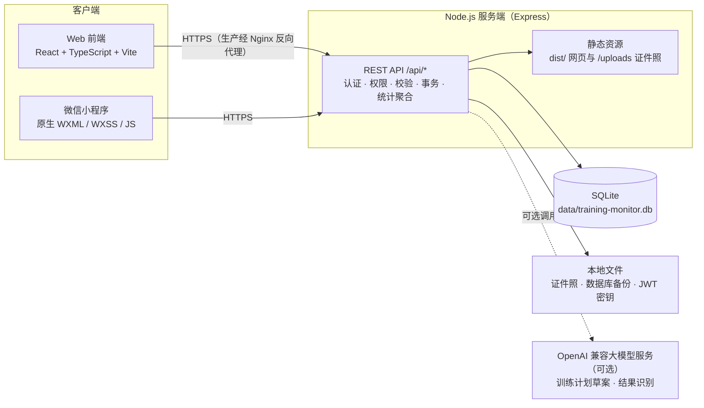

# 竞迹｜体育训练数据监控平台

竞迹是面向全国、省、市、区县各级体育管理部门与运动队伍的训练数据监控平台，覆盖训练数据采集与导入、训练负荷与恢复监控、体能与专项训练分析、运动员档案与冠军模型对标，帮助教练和管理者用统一口径评估训练效果、发现风险并制定训练计划。

平台由 Web 网页端、微信小程序和 Express 服务端组成，共用同一套账号权限与 SQLite 数据库。当前业务围绕赛艇、皮划艇（静水）与激流（回旋）开展，冠军模型与分析标准也按这三个项目配置；项目字典支持更多运动项目登记，各项目数据严格隔离。

**快速导航**：[系统架构](#2-系统架构) · [核心业务流程](#3-核心业务流程) · [功能模块](#4-功能模块) · [技术栈与目录结构](#5-技术栈与目录结构) · [数据库与数据流](#6-数据库与数据流) · [本地开发](#7-本地开发) · [部署说明](#8-部署说明) · [当前状态与已知限制](#9-当前状态与已知限制) · [文档索引](#10-文档导航)

## 1. 项目介绍

### 1.1 定位与目标

- 为多层级训练管理体系提供单一事实源：训练课次、恢复日报、体能测试、专项测试、伤病与身体测量统一入库、统一口径统计。
- 让教练从“Excel 汇总”转向“在线监控”：团队与个人的训练量、强度、负荷、恢复和测试进步一目了然。
- 用可追溯的标准做对标：冠军模型参考值带来源、协议与单位，缺失数据不补零、不虚构评分。

### 1.2 核心使用场景

| 场景           | 说明                                                                                 |
| -------------- | ------------------------------------------------------------------------------------ |
| 日常训练监控   | 教练查看团队训练量、强度区间、SRPE 负荷、RPE 与恢复状态，识别高负荷与伤病风险运动员  |
| 训练数据采集   | 运动员在小程序填报训练与恢复日报，教练代填补录，测试现场录入，Excel 批量导入历史数据 |
| 体能与专项分析 | 力量处方维护与执行分析、体能测试趋势、专项测试成绩与专项训练结构分析                 |
| 运动员档案     | 个人成长档案、身体成分、恢复趋势、个人 vs 团队对比、PDF 总结与训练日志导出           |
| 标准对标       | 冠军模型参考值对标（体能八维参考、专项冠军模型与赛事参考成绩），输出达成度与差距     |
| 组织与权限管理 | 分级账号体系、注册审核、组织维护、操作日志审计                                       |

### 1.3 服务对象与角色

服务对象为各级体育管理部门、运动队的管理人员、教练员和运动员。系统内置五级六类角色，所有账号同时绑定行政区域、项目和队伍，服务端按“角色 × 行政区域 × 项目/队伍”过滤数据。

| 角色         | 代码 | 数据范围                               |
| ------------ | ---- | -------------------------------------- |
| 运动员       | ATL  | 仅本人数据（可填报本人训练与恢复日报） |
| 队伍体能教练 | SCC  | 本人负责队伍的运动员                   |
| 项目负责人   | PRJ  | 授权区域内本项目                       |
| 区域负责人   | REG  | 本区域授权项目                         |
| 训练总监     | TD   | 管辖区域全部训练数据                   |
| 数据监控总监 | DMD  | 管辖区域全部数据、账号与操作日志       |

### 1.4 主要特点

- 权限在服务端强制执行：前端隐藏按钮不作为授权依据，越权请求返回 403；停用账号立即失效。
- 多渠道数据采集：微信小程序填报、教练代填、Excel 暂存导入、测试现场录入，全部落到同一套正式数据表。
- 导入先暂存后确认：Excel 解析进暂存区逐行校验，确认后事务提交，不覆盖既有真实数据。
- AI 输出始终是草案：AI 训练计划与结果识别需人工确认，服务端重新校验后才写入正式数据。
- 桌面端与移动端响应式界面；小程序复用同一 API、权限与数据库，不建第二套数据源。

## 2. 系统架构

系统采用模块化单体形态：前端、API、数据访问和分析模型位于同一仓库，生产环境由一个 Node.js 进程提供 API、上传文件与前端静态资源。



### 2.1 各模块职责

| 模块         | 位置                             | 职责                                                                                  |
| ------------ | -------------------------------- | ------------------------------------------------------------------------------------- |
| Web 前端     | `src/`                           | 登录、页面编排、图表可视化、PDF/Excel 导出；所有请求经 `src/api.ts` 发出              |
| 微信小程序   | `WeChat Mini Program/`           | 登录注册、训练总览、专项/体能页、档案、训练与日报填报、伤病上报、测试录入             |
| 后端 API     | `server/`                        | 认证（JWT）、权限裁剪、输入校验（zod）、业务事务、Excel 导入、AI 调用、文件上传与导出 |
| 数据库       | `data/training-monitor.db`       | SQLite（`node:sqlite` 内置模块，无 ORM），存全部业务数据                              |
| 本地文件     | `data/uploads/`、`data/backups/` | 运动员证件照、数据库定时备份、JWT 密钥文件                                            |
| 外部 AI 服务 | 可选配置                         | OpenAI 兼容 Chat Completions 接口，用于训练计划草案与图片/PDF 结果识别                |

### 2.2 运行拓扑

- **开发环境**：`npm run dev` 同时启动 Vite（`http://127.0.0.1:5173`）和 Express API（`http://127.0.0.1:8787`），Vite 将 `/api` 代理到 API；启动前预检 5173/8787 端口占用。
- **生产环境**：`npm run build` 产出 `dist/`，单个 Node 进程监听 `127.0.0.1:8787` 同时提供 `/api/*`、`/uploads/*` 与网页静态资源；由同机 Nginx 提供 HTTPS 接入，公网不得直接开放 8787 端口。

## 3. 核心业务流程

```text
注册申请 / 登录
       ↓
角色权限与组织绑定（角色 × 行政区域 × 项目 × 队伍）
       ↓
运动员 / 教练 / 队伍管理
       ↓
训练数据采集、录入与导入（小程序填报 / 教练代填 / Excel 导入 / 测试录入）
       ↓
数据校验、暂存确认与事务落库
       ↓
训练总览、专项训练、体能训练、生理生化
       ↓
运动员档案、测试分析与恢复趋势
       ↓
团队与个人对比、冠军模型对标
       ↓
辅助教练开展训练评估与计划制定
```

各环节的实际实现：

1. **注册与登录**：公开注册仅允许申请运动员或队伍体能教练，其余岗位由上级账号创建；“系统管理 → 账户审核”提供注册审核开关，开启时新注册需上级审核后方可登录。登录经限流与 bcrypt 校验后签发 JWT，每次请求重新确认账号状态。
2. **权限与组织绑定**：账号绑定上级、行政区域（全国/省/市/区县）、项目与队伍；绑定队伍后默认可见本队运动员。服务端按运动员访问范围裁剪数据，同级区域互相隔离。
3. **数据采集**：见 3.1；所有来源最终写入同一组正式业务表，并以 `source` 字段保留来源。
4. **校验与存储**：Excel 导入先进暂存区（`data_import_batches` / `data_import_items`）逐行校验、人工校对与运动员匹配，确认后事务提交，失败不留半批。AI 生成或识别的结果永远是草案，需人工确认后写入。
5. **分析与对标**：统计接口按团队去重口径（同队同日同课次去重）聚合训练量、强度、负荷、RPE 与测试数据；冠军模型参考值缺失时显示“待采集/待参考”，不补零、不计算虚假达成度。

### 3.1 数据写入路径

| 数据来源           | 入口接口                                                            | 落库表                                   | 来源标记                     |
| ------------------ | ------------------------------------------------------------------- | ---------------------------------------- | ---------------------------- |
| 小程序本人训练填报 | `POST /api/me/training-sessions`                                    | `training_sessions`                      | `source=athlete_self_report` |
| 小程序恢复日报     | `GET/POST /api/me/wellness`                                         | `daily_wellness`                         | `source=athlete_self_report` |
| 教练代填训练/日报  | `/api/athletes/:id/training-sessions`、`/api/athletes/:id/wellness` | 同上                                     | `source=coach_report`        |
| 通用 Excel 导入    | `/api/data-import/analyze` → `/api/data-import/batches/:id/commit`  | 暂存表 → 正式表                          | 导入批次追溯                 |
| 体能/专项测试录入  | `POST /api/strength-tests`、`POST /api/special-tests/manual`        | `test_sessions` / `test_measurements` 等 | 手工录入                     |
| 力量训练结果导入   | `/api/strength-training/import/*`                                   | `strength_result_sets`                   | 导入批次 + 审计日志          |

### 3.2 统计与图表数据来源

- 图表与统计全部读取服务端聚合接口（如 `/api/overview`、`/api/athletes/:id/overview`、`/api/analysis/summary`、`/api/coach/daily-todos`），不在前端二次拼口径。
- 缺失值与真实 0 严格区分：未采集显示缺失（“—”或留空断线），真实 0 保留 0 值行。
- 无真实数据时，部分可视化使用客户端固定示例图形并显式标记“示例数据”；示例不入库、不参与统计、排名与评价。

## 4. 功能模块

### 4.1 训练总览（已实现）

按项目、队伍和日/周/月/自定义时间范围查看团队与个人训练全貌：训练量统计（体能与专项合并柱状图，统一按分钟比较）、五项投入摘要、强度占比（U3/U2/U1/AT/TPT/AN/ATP）、训练负荷占比（SRPE 三柱结构）、RPE 均值 ± 标准差、运动损伤环形图、生理生化热力图、每日明细与训练记录。团队视图按同队同日同一课次去重，个人视图只统计本人实际参加数据；测试摘要按测试时长统计并去重重复参与记录。各训练页面统一使用日、周、月和自定义日期范围筛选，默认查看最近一月。

### 4.2 专项训练（已实现）

一级综合页面：冠军模型（赛艇世界最好成绩、陆上赛艇按体重档位连续提供，亚洲/国际/金牌三类标准并列，未核验标准标注“待核实”）、专项重要数据、训练量、强度占比（固定展示全部强度分区维度，0 值行保留）、训练课占比、SRPE 负荷分析与运动员概览；专项分析提供训练量分析页签（训练次数、累计距离、训练时间、按日趋势与运动员对比）。专项测试支持标准 Excel 模板下载、上传预览、逐行校验、确认入库与现场录入。页面底部运动员卡片选择后原地切换个人分析并保留团队参照。

### 4.3 体能训练（已实现）

- **体能测试**：测试录入与趋势（按指标展示团队平均变化，个人模式叠加个人值与团队平均），参考线优先取匹配项目/性别/小项/单位的冠军模型参考值（`radar_reference_values`），回退教练目标，均缺失则不画参考线；标准对比展示当前平均值、参考值、差值与达成度。
- **体能训练**：四周力量处方维护（最多 8 个项目，重量按 `MAX × 百分比` 计算，实际均重与雷达图实时联动）、逐组计划/实际结果、计划与实际课次完成率（按计划训练日与动作名称交集关联，无计划不计算完成率）、五类训练结构占比、证件照绑定与四周 Excel 模板导出。运动员只能查看本人计划与下载。
- **体能冠军参考模型**：按项目（赛艇、皮艇竞速、激流）与性别提供成人开放组八维参考（相对深蹲、相对卧拉、相对高拉、纵跳、2 分钟卧拉、前支撑、Wingate 相对峰值功率、VO₂max），标注为估算参考；包含参考信息、对比摘要、雷达、差距表与周期趋势。仅同时拥有全国、全部项目和全部队伍权限的 DMD 可修改参考值（持久化并记审计）；测试须匹配协议与单位才参与对标。

### 4.4 生理生化（已实现）

展示血乳酸、CK、BUN、Hb、HRV、RHR 等指标：训练总览内为热力图，运动员档案内为可切换指标趋势图、周期变化与完整检测明细。数据取自 `test_sessions` / `test_measurements`，不同指标、单位与协议分开绘制，演示与无效记录排除。当前库含模拟补充记录（见 6.6），正式试点前应替换为实测数据。

### 4.5 运动员档案（已实现）

单页整合个人信息、制胜要素、身体成分、体能与专项训练、恢复趋势、个人 vs 团队比较、训练情况对比（训练时长/累计负荷/专项距离）、雷达模型对照（赛艇专项 5 维、体能 6 维，缺失断线不补零）、生理生化与恢复状态、伤病与疼痛趋势。支持按周/按日导出总结 PDF 与训练日志 PDF（带水印），以及 A4 力量档案导出（含肌肉解剖图、测量线、教练目标差值与规则化个人评价）。所有卡片服从全局项目与日期范围，缺失日期不补零。

### 4.6 数据管理（已实现）

统一提供 Excel 暂存导入（下载模板 → 上传解析 → 预览逐行校验 → 确认入库）、导入记录、统一导出、指标字典、指标别名与数据标准维护。历史文件在确认前不会写入正式业务表。

### 4.7 组织管理（已实现）

运动员管理、教练管理、队伍管理：维护运动员主数据与档案、教练分类与人员关系（含展示用主管教练关系）、队伍与成员绑定。同一队伍可有多名教练，绑定队伍后默认可见本队运动员。

### 4.8 系统管理（已实现）

账号权限工作台（创建下级账号、设置角色/上级/多个行政区域/项目/队伍/启停状态，账号编号统一生成“行政区划代码-项目代码-角色代码-账号序号”）、注册审核开关与账户审核（通过/拒绝）、姓名统一修改入口（服务端校验上下级关系与数据范围）、用户自助修改密码、操作日志（DMD 可见最近 200 条）。

账号创建和授权编辑中的队伍通过下拉框选择，候选队伍按当前账号权限及所选项目筛选；切换项目需重新选择队伍。具备相应全部队伍权限的管理账号可选择“全部队伍”，无需手动输入通配符；已有但不在当前目录中的授权保留显示。

### 4.9 微信小程序（已实现，持续迭代）

原生微信小程序客户端，复用 Web 端 API、账号权限与数据库。共 13 个页面：登录、注册、训练总览（今日状态、每日训练待办、复查提醒）、专项训练、体能训练（概览/训练安排/训练记录）、档案（身体成分、训练对比、雷达对照、恢复状态、疼痛趋势、伤病上报）、资料编辑、训练填报、恢复日报、测试录入（体能/专项现场录入）、我的、隐私。支持教练代填、待办就地动作与“今日已跟进”标记、弱网草稿暂存（按“表单 × 身份”隔离）。登录/注册/“我的”页展示备案号“京ICP备2026065980号”并提供工信部备案查询入口复制。使用与排障见 [小程序说明](WeChat%20Mini%20Program/README.md)。

### 4.10 AI 训练建议（已实现，依赖配置）

- “个人档案 → 力量测试个人评价”可生成四周训练建议（未配置 AI 时使用内置规则并明确标注演示草案），教练可编辑并确认，运动员只能查看已确认版本；可导出含力量对比档案与训练建议的 PDF。
- AI 训练计划草案（分析/生成/保存）与力量导入的图片/PDF 结果识别走 OpenAI 兼容接口（配置百炼等服务后自动启用）；AI 输出均视为待审核草案，服务端重做校验后才可写入正式数据。
- API 密钥只配置在服务器环境变量，不发送到浏览器。

### 4.11 设备管理（部分实现）

“数据管理 → 设备管理”提供浏览器 Web Bluetooth 连接与读写演示页，用于设备联调试验；**服务端暂无设备数据接入接口**，蓝牙原始数据未接入正式统计。当前正式数据采集依赖 Excel 导入与手工/小程序填报。

## 5. 技术栈与目录结构

### 5.1 技术栈

| 层         | 技术                                                                                                                                           |
| ---------- | ---------------------------------------------------------------------------------------------------------------------------------------------- |
| Web 前端   | React + TypeScript（strict）+ Vite；图表 ECharts 与 Recharts；PDF 导出 jsPDF + html2canvas；Excel 处理 @e965/xlsx + exceljs；图标 lucide-react |
| 微信小程序 | 原生 WXML / WXSS / JavaScript，微信开发者工具开发                                                                                              |
| 后端       | Node.js（内置 `node:sqlite`）+ Express；zod 输入校验；jsonwebtoken + bcryptjs 认证；multer + sharp 上传与图片转码                              |
| 数据库     | SQLite（WAL、外键开启、busy_timeout），无 ORM，SQL 直写                                                                                        |
| AI（可选） | OpenAI 兼容 Chat Completions（如通义千问/百炼），支持备用与多区域模型配置                                                                      |
| 质量工具   | TypeScript、ESLint、Stylelint、Prettier、Vitest、Playwright（浏览器回归脚本）                                                                  |

### 5.2 核心目录

```text
jingji/
├── src/                    # Web 前端
│   ├── pages/              #   页面（总览、专项、体能、档案、导入、权限等）
│   ├── components/         #   跨页面组件（图表、冠军模型、选择器等）
│   ├── api.ts              #   唯一 API 调用入口（页面不直接拼认证请求）
│   ├── styles/             #   样式（styles.css 为 @import 入口，NN-*.css 按序级联）
│   └── pdf/                #   PDF 导出
├── server/                 # Express 服务端
│   ├── core/               #   数据库连接/初始化/迁移、认证、权限、备份、公共能力
│   ├── access/             #   登录注册、账号权限、注册审核
│   ├── athlete/            #   运动员档案、本人填报、教练代填、恢复日报
│   ├── analysis/           #   总览与档案聚合、体能冠军参考、RPE 统计
│   ├── special/            #   专项训练与专项测试
│   ├── strength/           #   体能测试、力量训练结果与 AI 导入
│   ├── training-plan/      #   四周训练计划与 AI 计划
│   └── data-import/        #   Excel 暂存导入
├── shared/                 # 前后端共享纯领域定义（项目字典、角色、指标口径等）
├── WeChat Mini Program/    # 原生微信小程序（pages/ services/ utils/ data/）
├── docs/                   # 架构、数据库、部署、验收与规格文档
├── deploy/nginx/           # Nginx 配置模板
├── scripts/                # 定向检查、演示数据与维护脚本
├── data/                   # SQLite 数据库、上传文件与备份（主库不入 Git）
├── compose.yaml            # 生产容器编排
└── Dockerfile              # 生产镜像构建
```

### 5.3 公共代码与业务模块的关系

`shared/` 只放前后端需要一致的纯领域定义与无环境依赖函数（项目字典 `projects.ts`、角色层级 `access.ts`、冠军模型 `champion-model.ts`、训练强度与分类口径等），不放数据库、HTTP、浏览器或密钥逻辑。服务端业务模块（`server/*`）负责校验、权限、事务与正式数据写入；前端页面只做装配与展示，跨页面组件放 `src/components/`，样式优先复用 `src/styles.css` / `src/styles/` 的色彩变量与通用组件样式。开发规范详见 [AGENTS.md](AGENTS.md)。

## 6. 数据库与数据流

### 6.1 数据库类型与位置

SQLite 单文件数据库，默认路径 `data/training-monitor.db`，由 `server/core/database-path.ts` 统一解析（可用环境变量 `DATABASE_PATH` 覆盖，连接前自动加载项目根目录 `.env`）。连接为 `node:sqlite` 的 `DatabaseSync`，配置 WAL、外键与 `busy_timeout=15000`。详细表清单与治理说明见 [数据库说明](docs/database.md) 与 [数据库视图](docs/database-view.md)。

### 6.2 初始化与迁移

- 启动入口 `server/core/db.ts`：连接数据库 → 旧库首次升级前保留 `*.before-reconstruction-v1` 原始副本 → `initializeDatabase()` 建表建索引。
- `server/core/db-initialize.ts` 通过“表存在性检查 + `app_metadata` 版本标记”保证**幂等**，新库旧库走同一流程，无需手工运行历史 SQL；`db-migrations.ts` 承载需保留旧数据的兼容迁移；`db-system-data.ts` 只补缺失的字典数据（强度分区、动作字典等）。
- 服务启动时自动执行兼容迁移与体能冠军参考补全；迁移只增不删，不删除真实数据。

### 6.3 核心数据表

| 数据域     | 主要表                                                                                                                       |
| ---------- | ---------------------------------------------------------------------------------------------------------------------------- |
| 训练事实   | `training_sessions`（一天多课次）、`training_session_segments`、`strength_result_sets`（力量组级结果）                       |
| 恢复       | `daily_wellness`（运动员 × 日期幂等覆盖）                                                                                    |
| 测试       | `test_sessions` → `test_measurements` → `metric_definitions`（含 `metric_aliases` 等字典）                                   |
| 导入暂存   | `data_import_batches`、`data_import_items`、`data_import_athlete_candidates`、`athlete_aliases`                              |
| 计划与健康 | `training_plans`（计划 JSON）、`injury_records`、`athlete_body_measurements`、`special_test_events` / `special_test_results` |
| 标准与审计 | `radar_reference_values`、`special_champion_models`、`audit_logs`、`coach_todo_followups`（仅工作流标记，不入统计）          |

新训练事实只写入 `training_sessions`、`daily_wellness` 和 `strength_result_sets`；旧 `training_records` 等历史表已从正式库移除，恢复只能依赖独立备份文件。

### 6.4 导入与落库流程

```text
下载模板 → 上传解析（analyze / preview）
   → 暂存区逐行校验（格式、数值范围、日期、单位）
   → 人工校对与运动员匹配（别名匹配 / 新建候选）
   → 选择冲突策略 → 事务提交（commit）
   → 写入正式表并回写批次追溯 + 审计日志
```

预览数据存于暂存表或进程内缓存，不直写正式业务表；提交失败不留半批。同一文件哈希与项目重复解析会先清理旧暂存批次。

### 6.5 备份

- 仅 `NODE_ENV=production` 启动自动备份：启动 5 分钟后首次执行，之后每 24 小时用 `sqlite3 .backup` 在线热备份，默认保留最近 7 天（按文件修改时间滚动计算，同日多份不会合并）。仅新备份成功后清理过期的 `jingji-*.db`，失败时不清理历史。开发、测试及未设置 `NODE_ENV` 的环境不启动备份调度器。
- 备份写入实际数据库同级的 `backups/`；默认目录 `data/backups/` 已由 Git 忽略（含 `.db`、`-wal` 和 `-shm` 文件）。忽略规则不删除现有备份。
- 本次将历史备份从 Git 跟踪列表移除，本机文件继续保留。其他已有检出目录更新到此变更前，应先在仓库外保全其中的备份及辅助文件；Git 更新会移除旧的跟踪路径。
- 构建和部署不得清理迁移前副本（`*.before-reconstruction-v1`）与既有备份；定时备份仅按上述保留规则清理自己生成的过期文件。生产环境另有每日 cron 备份与异机同步，见 [部署手册](docs/deployment-ubuntu-24.md)。

### 6.6 真实数据、演示数据与模拟数据

三个字段共同区分数据性质，统计口径不得混同：

| 字段      | 含义                                                                                                                                                                              |
| --------- | --------------------------------------------------------------------------------------------------------------------------------------------------------------------------------- |
| `source`  | 数据来源：`athlete_self_report` / `coach_report`（正式填报）、导入批次、`metric_gap_seed`（雷达展示补种）、`synthetic_30d_current_v1` / `user_requested_simulation`（模拟补充）等 |
| `quality` | 质量：`valid` / `estimated`                                                                                                                                                       |
| `is_demo` | 是否演示记录（演示记录不进入正式统计与导出）                                                                                                                                      |

**注意**：当前 `data/training-monitor.db` 内含 2026-10-08 一次性写入的模拟批次（覆盖 79 名运动员 2026-09-09 至 2026-10-08 的训练、恢复、力量、测试与专项测试记录）。其中 `source=synthetic_30d_current_v1` / `user_requested_simulation` 的记录虽按正常统计参与计算，但**并非实测采集**；正式试点前应以确认过的真实数据替换。新库初始化还会为缺少数据的运动员补种带“估算/演示”标记的指标用于雷达展示，这些记录不会覆盖导入或手工填写的真实数据。临时生成与导入这批数据的服务代码已移除，不提供重跑命令。

## 7. 本地开发

### 7.1 环境要求

- Node.js 22.x 或更高版本（项目使用内置 `node:sqlite`，20.x 无法运行；Windows 环境另见 [Windows 本地开发说明](WINDOWS_LOCAL_DEV.md)）。
- npm（随 Node.js 安装）。
- 微信开发者工具（仅小程序开发需要）。
- `sqlite3` 命令行工具（仅数据库在线备份需要，开发可选）。

### 7.2 安装与启动

```bash
npm install
npm run dev
```

打开 `http://127.0.0.1:5173`。`npm run dev` 会同时启动 Web（Vite）与 API（Express，`127.0.0.1:8787`），并预检端口占用。

### 7.3 环境变量（可选）

本地开发可在项目根目录创建 `.env`（已被 Git 忽略，切勿提交）：

| 变量                                                       | 说明                                 | 默认                                                  |
| ---------------------------------------------------------- | ------------------------------------ | ----------------------------------------------------- |
| `PORT` / `HOST`                                            | API 端口 / 监听地址                  | `8787` / `127.0.0.1`                                  |
| `DATABASE_PATH`                                            | SQLite 文件路径                      | `data/training-monitor.db`                            |
| `JWT_SECRET`                                               | JWT 签名密钥                         | 未设置时首次启动随机生成并持久化到 `data/.jwt-secret` |
| `ATHLETE_PHOTO_ROOT`                                       | 证件照存储目录                       | `data/uploads/athlete-photos`                         |
| `NODE_ENV` / `LOG_LEVEL`                                   | 运行环境 / 日志级别                  | `development` / 默认级别                              |
| `AI_BASE_URL` / `AI_API_KEY` / `AI_MODEL`                  | OpenAI 兼容 AI 服务（可选）          | 未配置时 AI 功能回退为内置规则草案                    |
| `AI_TIMEOUT_MS`、`AI_FALLBACK_*`、`AI_CN_*`、`AI_GEMINI_*` | AI 超时与备用/多区域模型配置（可选） | 见 `server/training-plan/ai-service.ts`               |

### 7.4 数据库初始化

无需手工建库：服务首次启动时自动在 `data/training-monitor.db` 建表、补字典并写入演示数据（含演示账号与示例运动员），之后每次启动按幂等迁移保持结构最新。

### 7.5 小程序开发准备

1. 使用微信开发者工具打开 `WeChat Mini Program/` 目录。
2. 本地联调：`WeChat Mini Program/config.js` 中 `API_ENVIRONMENT` 保持 `development`（指向 `http://127.0.0.1:8787`）；发布前必须改回 `production`（仅允许 HTTPS 地址）。
3. 注册用的项目/队伍字典与 Web 端共用，可用 `npm run mini:dictionary-check` 校验同步结果，`npm run mini:typecheck` 做小程序 TypeScript 检查。

### 7.6 常用命令

| 命令                                                                                                                                                                | 用途                                                             |
| ------------------------------------------------------------------------------------------------------------------------------------------------------------------- | ---------------------------------------------------------------- |
| `npm run dev`                                                                                                                                                       | 同时启动 Web 与 API 开发服务                                     |
| `npm run build`                                                                                                                                                     | 类型检查 + 构建生产 `dist/`                                      |
| `npm run start`                                                                                                                                                     | 启动生产服务（含静态资源托管）                                   |
| `npm run check`                                                                                                                                                     | TypeScript 全量类型检查                                          |
| `npm run lint` / `npm run lint:styles`                                                                                                                              | ESLint / Stylelint                                               |
| `npm run test`                                                                                                                                                      | Vitest 单元测试                                                  |
| `npm run format:check`                                                                                                                                              | Prettier 格式检查                                                |
| `npm run api-check`                                                                                                                                                 | API 回归检查                                                     |
| `npm run plan-check` / `npm run strength-training-check` / `npm run special-training-check` / `npm run special-test-check` / `npm run training-content-ratio-check` | 训练计划 / 体能训练 / 专项训练 / 专项测试 / 训练内容占比定向检查 |
| `npm run database-lock-check`                                                                                                                                       | 数据库并发写入检查                                               |
| `npm run mini:typecheck` / `npm run mini:dictionary-check`                                                                                                          | 小程序类型与字典同步检查                                         |
| `npm run daily-todos-example`                                                                                                                                       | 生成教练每日待办独立场景库（样例按正式口径参与统计）             |
| `npm run seed:special-training-demo`                                                                                                                                | 写入专项训练演示记录（`--clean` 清理）                           |

启动 API 和网页后可执行浏览器回归检查：`npm run visual-check -- <输出目录> http://127.0.0.1:5173`、`npm run plan-visual-check`。

### 7.7 演示账号

新库初始化自动创建演示账号（`athlete01`、`coach01`、`coach02`、`project01`、`regional01`、`executive01`、`admin01`），分别覆盖运动员、教练（含同队多教练场景）、项目负责人、区域负责人、训练总监与数据监控总监角色，用于本地体验各角色的数据范围。初始密码为统一演示密码，定义在 `server/core/db-initialize.ts` 的演示数据初始化中，仅限本地演示；**首次部署后必须立即通过侧栏底部的钥匙按钮全部修改**，正式环境不应保留演示账号。

## 8. 部署说明

生产部署以 [Ubuntu 24.04 部署手册](docs/deployment-ubuntu-24.md) 为准，本节只做摘要，不重复维护长篇教程。

### 8.1 生产架构与发布链路

- 架构：Mac 端用 Colima + `docker buildx` 构建 `linux/amd64` 镜像并推送阿里云 ACR → Ubuntu ECS 拉取镜像经 `compose.yaml` 运行 → Nginx 提供 HTTPS 反向代理到 `127.0.0.1:8787`。服务器不克隆代码、不构建镜像。
- 安全组仅放行 80/443（公网）与 22（限办公 IP），严禁公开 8787；域名需完成 ICP 备案。
- 容器：`compose.yaml` 固定端口映射 `127.0.0.1:8787:8787`、数据卷 `./data:/app/data`（数据库与上传跨更新持久化）、健康检查与日志轮转；镜像由 `Dockerfile` 构建（`npm ci` → `npm run build` → `npm run start`）。
- 更新与回滚：以 Git 提交短哈希为镜像标签，ECS 端更新 `IMAGE_TAG` 后 `docker compose pull && up -d`；回滚即换回旧标签。

### 8.2 构建与启动

```bash
npm ci
npm run build
npm run start
```

### 8.3 Nginx 与 HTTPS

- HTTP 仅做 301 跳转 HTTPS；TLS 使用 TLSv1.2/1.3；反向代理传递 `Host`、`X-Real-IP`、`X-Forwarded-For/Proto`。
- 配置模板见 [deploy/nginx/jingji.conf.example](deploy/nginx/jingji.conf.example)（模板含占位域名与示例路径，实际以部署手册中的配置为准）。
- 当前使用阿里云个人测试证书，**无法自动续期**，到期需手动替换 `.pem`/`.key` 后 `nginx -t` 并 reload。

### 8.4 数据库备份

- 生产环境（`NODE_ENV=production`）启用内置定时备份：启动 5 分钟后首次执行，之后每 24 小时 `sqlite3 .backup` 热备份到实际数据库同级的 `backups/`（默认 `data/backups/`），默认保留最近 7 天，成功后才清理过期备份；依赖运行环境内 `sqlite3` CLI。
- 生产环境另配 cron 每日 03:15 备份，并将备份目录同步到 OSS 等异机位置；禁止用 `cp` 直接复制活动中的数据库文件。

### 8.5 生产环境变量

`NODE_ENV=production`、`HOST`、`PORT=8787`、`DATABASE_PATH`、`JWT_SECRET`（用 `openssl rand` 生成，不得依赖自动生成文件）、`ATHLETE_PHOTO_ROOT`、`AI_*`（可选）、`TZ=Asia/Shanghai`。`.env` 权限 600，不入 Git、不入镜像。正式上线前必须修改全部演示账号密码。

### 8.6 微信小程序发布要求

- 生产 API 必须是 HTTPS 域名；在微信公众平台将该域名登记为 `request` / `uploadFile` / `downloadFile` 合法域名。
- 发布前将 `WeChat Mini Program/config.js` 的 `API_ENVIRONMENT` 改为 `production`，`NETWORK_DEBUG` 保持 `false`，并核对小程序备案信息。
- 真机网络问题的 TLS 检查与验收步骤见 [小程序说明](WeChat%20Mini%20Program/README.md#资料保存与真机网络排障)。

> 根目录 [DEPLOY_UBUNTU24.md](DEPLOY_UBUNTU24.md) 是早期“服务器克隆代码 + PM2 + Certbot”部署路线的记录，与现行 Docker/ACR 链路不同，仅作历史参考。

## 9. 当前状态与已知限制

### 9.1 已实现

- 五级六类角色的账号权限体系（角色 × 行政区域 × 项目/队伍）、注册审核、账号启停即时失效、操作日志审计。
- 训练总览（训练量、强度、负荷、RPE、损伤、生理生化热力图、每日明细）。
- 专项训练（冠军模型、专项数据、训练量/强度/课次/负荷分析、专项测试录入与 Excel 导入）。
- 体能训练（体能测试与趋势、四周力量处方与执行结果、体能冠军参考模型、导入与 Excel 导出）。
- 运动员档案（个人/团队对比、雷达对照、恢复趋势、生理生化明细、PDF 总结与训练日志、力量档案导出）。
- 数据管理（Excel 暂存导入与确认、导入记录、指标字典/别名/标准）、组织管理、系统管理。
- 微信小程序全量页面（填报、日报、待办、伤病、测试录入、草稿暂存、教练代填）。
- AI 训练建议与 AI 训练计划草案（人工确认后入库）。

### 9.2 部分实现

- **设备接入**：仅有浏览器 Web Bluetooth 演示页，服务端无设备数据接入接口，蓝牙数据不进入正式统计。
- **冠军模型覆盖**：体能冠军参考为估算参考值（覆盖赛艇、皮艇竞速、激流成人开放组）；赛艇专项雷达与参考标准（版本 `GJ-ROW-2026.07-R1`）可用，皮划艇及其他项目的雷达维度与参考标准待单独审核与配置。
- **生理生化数据**：展示与统计链路完整，但当前库数据含模拟补充批次，实测数据待接入。

### 9.3 尚未支持

- Wingate、左右差、生理生化星级、Z-Score 参考人群与综合权重等待专家确认后启用。
- 多实例/集群部署与 PostgreSQL 迁移（SQLite 单机形态，迁库需先抽离 SQL 方言与初始化逻辑）。
- 字段级权限、敏感字段脱敏与导出审计（见 [运维安全交付清单](docs/operations-security-delivery-checklist.md) 整改项）。
- 蓝牙设备正式数据采集与协议标准化。

### 9.4 已知问题与注意事项

- 当前库含模拟批次数据（见 6.6），不可将统计结果当作实测结论；演示数据不得进入生产统计与导出。
- 导入预览缓存在进程内，服务重启后预览失效属预期行为，需重新解析。
- 前端在浏览器 localStorage 保存 JWT，依赖严格 XSS 防护；运动员证件照经静态目录 `/uploads` 提供。
- 各文档对上传大小上限口径不一致（证件照 12 MB、导入 80 MB、Nginx 示例 20m 等），调整时以代码 `server/core/uploads.ts` 与实际 Nginx 配置为准。
- 异常状态判断使用固定阈值（不调用大模型），阈值需与教练团队确认后调整。
- 仓库内部分早期文档已过期（如 `docs/specs/` 多个规格仍为占位、`docs/database.md` 关于旧表的描述滞后），以代码与本 README 为准，详见 [文档导航](#10-文档导航) 中的备注。

## 10. 文档导航

| 文档                                                                                             | 内容                                               |
| ------------------------------------------------------------------------------------------------ | -------------------------------------------------- |
| [AGENTS.md](AGENTS.md)                                                                           | 项目协作与开发规范                                 |
| [docs/architecture.md](docs/architecture.md)                                                     | 系统架构、模块边界、关键数据流                     |
| [docs/database.md](docs/database.md)                                                             | 数据库现状、核心关系与治理建议（旧表描述部分滞后） |
| [docs/database-view.md](docs/database-view.md)                                                   | 表清单与数据库视图说明（表数量统计口径待订正）     |
| [docs/deployment-ubuntu-24.md](docs/deployment-ubuntu-24.md)                                     | 现行生产部署手册（Docker/ACR/Nginx/HTTPS）         |
| [docs/acceptance-criteria.md](docs/acceptance-criteria.md)                                       | 验收标准（权限、导入、AI、设备、导出等）           |
| [docs/operations-security-delivery-checklist.md](docs/operations-security-delivery-checklist.md) | 运维、安全与交付检查清单                           |
| [docs/specs/README.md](docs/specs/README.md)                                                     | 功能规格索引（多个规格文件目前仍是占位）           |
| [docs/business/](docs/business/)                                                                 | 业务说明（运动员/比赛/训练，当前内容待补充）       |
| [WeChat Mini Program/README.md](WeChat%20Mini%20Program/README.md)                               | 小程序页面、数据口径、本地预览与排障               |
| [WINDOWS_LOCAL_DEV.md](WINDOWS_LOCAL_DEV.md)                                                     | Windows 本地开发说明                               |
| [DEPLOY_UBUNTU24.md](DEPLOY_UBUNTU24.md)                                                         | 早期部署路线记录（历史参考）                       |
| [deploy/nginx/jingji.conf.example](deploy/nginx/jingji.conf.example)                             | Nginx 配置模板                                     |
