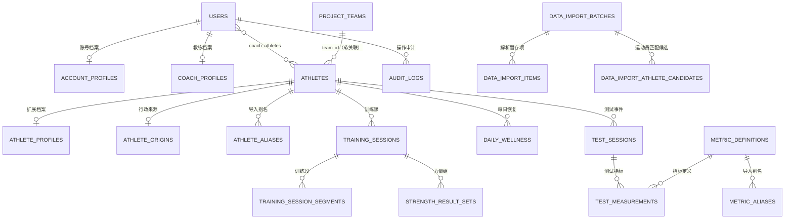

# 竞迹数据库总览

> 数据源：`data/training-monitor.db` 实际 SQLite 架构（2026-09-06）。
>
> 本文描述的是**当前数据库事实**，不是未来设计草案。当前共 **42 张业务表**；SQLite 内部的 `sqlite_*` 表不计入其中。

## 1. 如何阅读

- `PK`：主键，唯一定位一条记录。
- `FK`：数据库外键，SQLite 会校验其引用目标存在。
- `软关联`：由服务端查询或业务规则维护，数据库未声明外键。
- 日期字段统一以 `YYYY-MM-DD` 文本保存；时间量、距离和成绩的单位由字段名或指标字典确定。
- `source`、`quality`、`is_demo` 用于标记来源、质量和演示数据，避免把不同可信度的数据混为一谈。

## 2. 全局实体关系



## 3. 按业务域查看

| 业务域 | 表数量 | 核心表 | 用途 |
| --- | ---: | --- | --- |
| 组织、账号与权限 | 11 | `users`、`athletes`、权限表 | 身份、组织范围、教练与运动员关系 |
| 训练与恢复 | 6 | `training_sessions`、`training_session_segments`、`strength_result_sets`、字典表 | 训练事实、分段、力量组、强度与动作标准 |
| 测试、身体与竞技状态 | 8 | `test_sessions`、`test_measurements`、指标表 | 体测、身体成分、评分与竞技状态 |
| 导入与审计 | 5 | `data_import_batches`、`data_import_items` | Excel/文件解析、人工确认和审计 |
| 计划与专项测试 | 8 | 专项计划、专项测试、训练计划 | 计划编排与多人/船组测试 |
| 系统配置 | 4 | `app_metadata`、注册申请等 | 初始化版本、偏好与系统治理 |

## 4. 组织、运动员、账号与权限

### 4.1 运动员主数据

| 表 | 含义 | 主键与关联 | 字段 |
| --- | --- | --- | --- |
| `athletes` | 运动员核心身份 | `id` PK；`team_id` 软关联 `project_teams.id` | `id`, `name`, `project`, `team`, `team_id`, `gender`, `region`, `city`, `county`, `birth_date`, `photo_url`, `profile_status`, `source`, `data_import_batch_id`, `active` |
| `athlete_profiles` | 一对一扩展档案 | `athlete_id` PK/FK → `athletes.id` | `athlete_id`, `identity_number`, `ethnicity`, `phone`, `blood_type`, `emergency_contact`, `emergency_phone`, `education`, `technical_level`, `health_status`, `best_result`, `native_place`, `home_address`, `athlete_status`, `start_sport_date`, `training_venue`, `current_event`, `training_phase`, `camp_period`, `origin_place`, `origin_unit`, `origin_coach`, `specialties`, `notes`, `position`, `created_at`, `updated_at` |
| `athlete_origins` | 运动员行政来源唯一表 | `athlete_id` PK/FK → `athletes.id` | `athlete_id`, `province`, `city`, `county`, `source`, `quality`, `is_demo`, `updated_at` |
| `athlete_aliases` | 姓名别名和导入匹配依据 | `id` PK；`athlete_id` FK → `athletes.id`；`confirmed_by` FK → `users.id` | `id`, `athlete_id`, `alias`, `normalized_alias`, `project`, `source`, `confirmed_by`, `created_at` |
| `project_teams` | 项目下的队伍目录 | `id` PK；`project + name` 唯一 | `id`, `project`, `name`, `active`, `created_at` |

当前 `athletes` 仍同时保存 `team`、`region`、`city`、`county` 字符串；其收敛目标分别是 `team_id` 与 `athlete_origins`，尚未完成字段删除。因此读取时需以服务端接口的当前口径为准。

### 4.2 用户、教练与权限

| 表 | 含义 | 主键与关联 | 字段 |
| --- | --- | --- | --- |
| `users` | 登录账号和角色 | `id` PK；`athlete_id` FK → `athletes.id` | `id`, `username`, `password_hash`, `display_name`, `role`, `athlete_id`, `active` |
| `account_profiles` | 账号层级/编号 | `user_id` PK/FK → `users.id`；`parent_user_id` FK → `users.id` | `user_id`, `parent_user_id`, `account_code`, `created_at`, `updated_at` |
| `coach_profiles` | 教练专业类别 | `user_id` PK/FK → `users.id` | `user_id`, `category`, `updated_at` |
| `coach_athletes` | 教练—运动员多对多关系 | 联合 PK：`coach_user_id + athlete_id`，均为 FK | `coach_user_id`, `athlete_id` |
| `user_area_permissions` | 行政区域权限 | 联合 PK：`user_id + area_level + province + city + county` | `user_id`, `area_level`, `province`, `city`, `county`, `granted_by`, `created_at` |
| `user_project_permissions` | 项目权限 | 联合 PK：`user_id + project` | `user_id`, `project`, `granted_by`, `created_at` |
| `user_team_permissions` | 队伍权限 | 联合 PK：`user_id + project + team` | `user_id`, `project`, `team`, `granted_by`, `created_at` |
| `regional_manager_regions` | 区域负责人所属地区 | 联合 PK：`manager_user_id + region` | `manager_user_id`, `region`, `granted_by`, `created_at` |
| `user_dashboard_preferences` | 看板布局偏好 | 联合 PK：`user_id + dashboard + project + scope` | `user_id`, `dashboard`, `project`, `scope`, `layout_json`, `updated_at` |
| `registration_requests` | 注册申请和审核状态 | `id` PK；`reviewed_by` FK → `users.id` | `id`, `username`, `password_hash`, `display_name`, `requested_role`, `project`, `team`, `gender`, `identity_number`, `native_place`, `region`, `city`, `county`, `status`, `reviewed_by`, `reviewed_at`, `created_at` |

## 5. 训练、力量与每日恢复

### 数据层次

```text
athletes
  ├─ training_sessions（一堂训练课）
  │    ├─ training_session_segments（课内多个训练段）
  │    └─ strength_result_sets（力量训练的逐动作、逐组结果）
  └─ daily_wellness（每天最多一条恢复状态）
```

| 表 | 含义 | 主键与关联 | 字段 |
| --- | --- | --- | --- |
| `training_sessions` | 训练课主表；同一运动员一天可通过 `session_order` 有多课 | `id` PK；`athlete_id` FK → `athletes.id`；`created_by` FK → `users.id` | `id`, `athlete_id`, `session_date`, `session_order`, `start_time`, `training_type`, `structure_type`, `intensity_zone`, `content`, `duration_min`, `distance_km`, `duration_reported`, `distance_reported`, `rpe`, `srpe`, `smvl`, `average_heart_rate`, `max_heart_rate`, `average_power_w`, `stroke_rate_spm`, `source`, `quality`, `is_demo`, `created_by`, `updated_at`, `specialty_id`, `plan_session_id` |
| `training_session_segments` | 训练课内部的段落结构 | `id` PK；`training_session_id` FK → `training_sessions.id` | `id`, `training_session_id`, `segment_order`, `environment`, `training_focus`, `category_code`, `category_label`, `duration_min`, `distance_km`, `intensity_zone`, `zone_system`, `source`, `quality`, `is_demo`, `created_at` |
| `strength_result_sets` | 力量训练的组级结果；唯一权威力量组表 | `id` PK；`training_session_id` FK → `training_sessions.id`；`created_by` FK → `users.id` | `id`, `training_session_id`, `exercise_code`, `exercise_name`, `set_index`, `target_reps`, `actual_reps`, `actual_weight_kg`, `planned_weight_kg`, `training_category`, `body_position`, `training_environment`, `duration_min`, `distance_km`, `intensity_percent`, `intensity_zone`, `rpe`, `completed`, `note`, `source`, `data_import_batch_id`, `source_row`, `original_text`, `ai_confidence`, `created_by`, `updated_at` |
| `daily_wellness` | 日常恢复与晨间状态 | `id` PK；`athlete_id` FK → `athletes.id`；`athlete_id + wellness_date` 唯一 | `id`, `athlete_id`, `wellness_date`, `sleep_hours`, `sleep_quality`, `morning_pulse`, `weight_kg`, `fatigue_index`, `soreness_index`, `mood_index`, `status`, `source`, `quality`, `is_demo`, `updated_at` |
| `intensity_zone_definitions` | 强度体系与分区字典 | `id` PK；`zone_system + zone_code` 唯一 | `id`, `zone_system`, `zone_code`, `zone_name`, `description`, `sort_order`, `active`, `created_at`, `updated_at` |
| `exercise_definitions` | 力量动作标准字典 | `id` PK；`exercise_code` 唯一 | `id`, `exercise_code`, `exercise_name`, `category`, `default_unit`, `active`, `created_at`, `updated_at` |

注意：`training_sessions.specialty_id`、`training_sessions.plan_session_id` 目前未声明 SQLite 外键，分别由专项目录、专项计划课次在应用层关联。

## 6. 测试、指标、身体与竞技状态

| 表 | 含义 | 主键与关联 | 字段 |
| --- | --- | --- | --- |
| `test_sessions` | 单个运动员的一次测试事件 | `id` PK；`athlete_id` FK → `athletes.id`；`created_by` FK → `users.id` | `id`, `athlete_id`, `test_date`, `test_type`, `protocol`, `source`, `quality`, `is_demo`, `created_by`, `created_at` |
| `test_measurements` | 测试事件中的单项结构化结果 | `id` PK；`test_session_id` FK → `test_sessions.id`；`metric_code` FK → `metric_definitions.code` | `id`, `test_session_id`, `metric_code`, `value_num`, `target_value`, `unit`, `side`, `quality`, `source`, `is_demo`, `data_import_batch_id`, `source_ref`, `created_at` |
| `metric_definitions` | 系统唯一指标字典 | `code` PK | `code`, `label`, `domain`, `unit`, `direction`, `frequency`, `projects_json`, `minimum`, `maximum`, `active`, `updated_at` |
| `metric_aliases` | Excel/历史名称到指标编码的映射 | `alias` PK；`metric_code` FK → `metric_definitions.code` | `alias`, `normalized_alias`, `metric_code`, `canonical_label`, `unit`, `side`, `updated_at` |
| `athlete_body_measurements` | 正式身体成分与体型测量 | `id` PK；`athlete_id` FK → `athletes.id` | `id`, `athlete_id`, `measurement_date`, `height_cm`, `weight_kg`, `body_fat_pct`, `skeletal_muscle_kg`, `muscle_mass_kg`, `upper_limb_muscle_kg`, `lower_limb_muscle_kg`, `trunk_muscle_kg`, `subcutaneous_fat_mm`, `triceps_skinfold_mm`, `abdominal_skinfold_mm`, `thigh_skinfold_mm`, `calf_skinfold_mm`, `visceral_fat_level`, `basal_metabolism_kcal`, `total_body_water_kg`, `ecw_tbw_ratio`, `phase_angle_deg`, `visceral_fat_area_cm2`, `left_arm_lean_kg`, `right_arm_lean_kg`, `trunk_lean_kg`, `left_leg_lean_kg`, `right_leg_lean_kg`, `note`, `source`, `quality`, `is_demo`, `data_import_batch_id`, `created_at` |
| `injury_records` | 伤病、限制和康复记录 | `id` PK；`athlete_id` FK → `athletes.id`；`created_by` FK → `users.id` | `id`, `athlete_id`, `record_type`, `injury_name`, `body_part`, `side`, `status`, `pain_score`, `onset_date`, `restrictions`, `rehab_plan`, `review_date`, `note`, `created_by`, `created_at` |
| `competitive_state_assessments` | 竞技状态多维评分结果 | `id` PK；`athlete_id` FK → `athletes.id` | `id`, `athlete_id`, `assessment_date`, `overall_score`, `state_level`, `endurance_score`, `power_score`, `technique_score`, `load_adaptation_score`, `recovery_score`, `competition_score`, `note`, `source`, `quality`, `is_demo`, `created_at` |
| `metric_scoring_rules` | 指标到评分的规则 | `id` PK；`metric_code` FK → `metric_definitions.code`；`source_batch_id` FK → `data_import_batches.id` | `id`, `project`, `gender`, `metric_code`, `score`, `threshold_value`, `comparison`, `rule_version`, `source_batch_id`, `active`, `created_at` |
| `champion_model_standards` | 冠军模型的指标目标与权重 | `id` PK；`metric_code` FK → `metric_definitions.code` | `id`, `project`, `gender`, `metric_code`, `model_version`, `target_min`, `target_max`, `elite_mean`, `weight`, `rationale`, `source_note`, `active`, `updated_at` |
| `strength_ai_advice` | 对测试事件生成的 AI/规则建议草案 | `id` PK；`test_session_id` FK → `test_sessions.id`；操作者 FK → `users.id` | `id`, `test_session_id`, `version`, `content_json`, `source`, `model`, `status`, `generated_by`, `reviewed_by`, `generated_at`, `reviewed_at`, `updated_at` |

`daily_wellness.weight_kg` 表示日常监控体重；`athlete_body_measurements.weight_kg` 表示正式身体成分测试体重，两者语义不同，允许并存。

## 7. 数据导入与审计

```text
文件
  → data_import_batches（一次导入任务）
  → data_import_items（每个解析项）
  → 运动员匹配 / 指标映射 / 校验
  → 提交至训练、测试、身体等正式表
```

| 表 | 含义 | 主键与关联 | 字段 |
| --- | --- | --- | --- |
| `data_import_batches` | 一个文件的一次导入任务 | `id` PK；`created_by` FK → `users.id` | `id`, `file_hash`, `source_filename`, `source_mimetype`, `file_size`, `project`, `parser_version`, `status`, `sheet_count`, `item_count`, `valid_count`, `warning_count`, `error_count`, `imported_count`, `skipped_count`, `summary_json`, `storage_path`, `created_by`, `created_at`, `committed_at` |
| `data_import_items` | 统一导入暂存项；`payload_json` 可保存原始解析内容 | `id` PK；`batch_id` FK → `data_import_batches.id`；`athlete_id` FK → `athletes.id` | `id`, `batch_id`, `item_type`, `athlete_id`, `raw_athlete_name`, `event_date`, `session_label`, `test_type`, `metric_code`, `metric_label`, `side`, `value_num`, `unit`, `exercise_name`, `set_index`, `target_reps`, `actual_reps`, `actual_weight_kg`, `intensity_percent`, `payload_json`, `source_sheet`, `source_address`, `raw_value`, `quality`, `messages_json`, `business_key`, `committed_entity_type`, `committed_entity_id`, `created_at` |
| `data_import_athlete_candidates` | 导入中待确认的运动员匹配/新建候选 | `id` PK；`batch_id` FK → `data_import_batches.id`；两个运动员字段 FK → `athletes.id` | `id`, `batch_id`, `normalized_name`, `name`, `project`, `team`, `gender`, `region`, `city`, `county`, `status`, `matched_athlete_id`, `created_athlete_id`, `source_sheet`, `messages_json`, `created_at` |
| `audit_logs` | 关键操作审计日志 | `id` PK；`user_id` FK → `users.id` | `id`, `user_id`, `action`, `entity_type`, `entity_id`, `detail`, `created_at` |
| `app_metadata` | 初始化、迁移与系统元数据键值表 | `key` PK | `key`, `value`, `updated_at` |

导入批次标识目前在若干正式表中以 `data_import_batch_id` 保存，但未全部声明为 SQLite 外键；它用于追溯来源，完整性由提交服务维护。

## 8. 训练计划与专项测试

| 表 | 含义 | 主键与关联 | 字段 |
| --- | --- | --- | --- |
| `training_plans` | 单个运动员的训练计划快照 | `id` PK；`athlete_id`、`created_by`、`updated_by` 均为 FK | `id`, `athlete_id`, `plan_date`, `start_date`, `end_date`, `title`, `schedule_label`, `plan_data`, `ai_metadata`, `created_by`, `updated_by`, `updated_at` |
| `specialty_catalog` | 专项训练目录/模板定义 | `id` PK | `id`, `code`, `name`, `template_key`, `description`, `active`, `created_at` |
| `special_training_plans` | 项目级专项周计划 | `id` PK；`created_by` FK → `users.id` | `id`, `project`, `week_start`, `title`, `status`, `created_by`, `created_at`, `updated_at` |
| `special_training_plan_sessions` | 专项周计划中的课次 | `id` PK；`plan_id` FK → `special_training_plans.id`；`specialty_id` FK → `specialty_catalog.id` | `id`, `plan_id`, `specialty_id`, `session_date`, `start_time`, `end_time`, `training_type`, `content`, `venue`, `target_json`, `session_order`, `created_at` |
| `special_test_events` | 船组/多人专项测试事件 | `id` PK；`created_by` FK → `users.id` | `id`, `test_date`, `project`, `distance_m`, `boat_class`, `gender_group`, `session`, `wind_conditions`, `location`, `note`, `created_by`, `created_at`, `specialty_id`, `plan_session_id` |
| `special_test_results` | 一个专项测试事件下的船组成绩 | `id` PK；`event_id` FK → `special_test_events.id` | `id`, `event_id`, `crew_name`, `member_athlete_ids`, `member_names`, `previous_best_ms`, `attempts_ms`, `average_ms`, `best_ms`, `created_at` |

专项测试的船组成员当前以 `member_athlete_ids`、`member_names` 文本保存；它是当前多人组合测试的专用表示，并非单人 `test_sessions` 的重复来源。

## 9. 当前已删除与尚未落库的设计项

### 已从正式库删除的旧表

`training_records`、`athlete_strength_tests`、`strength_training_sets`、`strength_import_batches` 均不在当前 40 张表中。历史恢复依赖独立备份文件，而非生产库兼容表。

### Spec 中建议、但当前实际库尚未具备的表/字段

| 项目 | 当前状态 |
| --- | --- |
| `intensity_zone_definitions` | 已建立；已初始化 `ROWING_U` 与 `ROWING_UT` 两套共 13 个分区。 |
| `exercise_definitions` | 已建立；已初始化深蹲、卧拉、卧推、硬拉、腿举、引体向上 6 个动作。 |
| `data_import_batches.storage_path` | 已建立；当前导入流程尚未持久化原始文件。 |
| `injury_records.severity/recovery_date/return_training_date` | **不存在**。 |
| `athletes.team/region/city/county` 删除 | **尚未完成**；重复字段仍保留，见第 4.1 节。 |

## 10. 日常定位指南

| 你想找的数据 | 首先查看 |
| --- | --- |
| 某运动员基本身份、所属队伍 | `athletes`，再结合 `project_teams` |
| 籍贯/行政来源 | `athlete_origins` |
| 某天练了什么、多久、多少公里 | `training_sessions` |
| 一堂训练的 U2/U3/AT 等结构 | `training_session_segments` |
| 深蹲、卧推等逐组负荷 | `strength_result_sets` |
| 睡眠、晨脉、疲劳、晨重 | `daily_wellness` |
| 某次体测及每个指标 | `test_sessions` → `test_measurements` → `metric_definitions` |
| 身体成分测试 | `athlete_body_measurements` |
| 伤病与康复限制 | `injury_records` |
| 导入文件的解析、校验与提交状态 | `data_import_batches` → `data_import_items` |
| 谁对什么进行了操作 | `audit_logs` |
