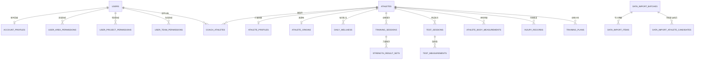

# 竞迹数据库现状与优化说明

> 本文依据当前 `server/db.ts` 的表定义、迁移逻辑及调用关系整理，描述的是**模型设计**，不读取或披露任何运行数据库中的真实数据。
>
> 适用数据库：SQLite。表结构、兼容迁移和演示初始化目前均由 `server/db.ts` 在应用启动时执行。

## 1. 先看全局：数据库在解决什么问题

数据库围绕“运动员”保存五类事实：

1. 谁可以访问和管理谁（账号、层级、区域、项目、队伍、教练关系）；
2. 运动员是谁及其稳定档案（基础资料、来源、身体测量）；
3. 做了什么训练、恢复得如何、完成了哪些力量组次；
4. 测了什么、成绩如何、竞技状态如何；
5. 数据从哪里来、谁确认过、发生过哪些管理操作。

当前最重要的结论是：**训练和力量测试存在新旧两套事实模型，且部分接口仍在读取旧表。** 因此同一运动员在不同页面、统计或 AI 上下文中可能得到不同的结果。数据库优化应先统一数据真相，再处理拆表、索引和部署扩展。

## 2. 核心关系图

`special_test_events` 与 `special_test_results` 是专项测试的事件—成绩模型；`strength_import_batches` 与 `strength_result_sets` 是体能结果导入的专用追溯模型。两者均与上图主链并列。

## 3. 当前表清单

### 3.1 系统、账号与授权

| 表 | 职责 | 关键关系/说明 |
| --- | --- | --- |
| `app_metadata` | 保存初始化或迁移任务的版本标记 | 用于避免同一初始化任务重复运行。 |
| `users` | 登录账号、密码哈希、角色、停用状态 | 运动员账号可通过 `athlete_id` 绑定运动员。 |
| `account_profiles` | 账号编码与直属上级 | `parent_user_id` 建立管理链。 |
| `coach_profiles` | 教练类别 | 仅扩展教练账号。 |
| `registration_requests` | 注册申请及审批状态 | 含申请阶段的身份信息，应按敏感数据处理。 |
| `user_dashboard_preferences` | 用户看板布局偏好 | 以用户、看板、项目、范围为联合主键。 |
| `user_area_permissions` | 全国/省/市/区县授权 | 是当前区域权限的主模型。 |
| `user_project_permissions` | 项目授权 | 与区域、队伍授权共同裁剪数据范围。 |
| `user_team_permissions` | 队伍授权 | 以项目和队伍联合授权。 |
| `regional_manager_regions` | 区域负责人旧授权关系 | 仍用于兼容迁移，和 `user_area_permissions` 有职能重叠。 |
| `coach_athletes` | 教练—运动员多对多关系 | 决定教练是否可管理某位运动员。 |
| `project_teams` | 项目下可用队伍字典 | `project + name` 唯一。 |
| `audit_logs` | 关键操作审计 | 记录操作者、动作、实体和详情。 |

### 3.2 运动员主数据与健康档案

| 表 | 职责 | 关键关系/说明 |
| --- | --- | --- |
| `athletes` | 运动员聚合根 | 当前项目、队伍、区域、性别、出生日期、照片与启用状态均在此。 |
| `athlete_profiles` | 运动员扩展档案 | 联系方式、紧急联系人、技术等级、项目经历、训练信息等。 |
| `athlete_origins` | 来源地区、数据来源及演示标记 | 每位运动员最多一条。 |
| `athlete_body_measurements` | 按日期的身体成分和围度/肌肉测量 | 每位运动员每天最多一条。 |
| `injury_records` | 正式伤病与主观反馈 | 含部位、侧别、疼痛、限制、康复、复查信息。 |

### 3.3 训练、恢复与计划

| 表 | 状态 | 职责 |
| --- | --- | --- |
| `daily_wellness` | **当前模型** | 每日睡眠、晨脉、体重、疲劳、酸痛、情绪、质量和来源。 |
| `training_sessions` | **当前模型** | 一天可有多课次的训练事实，保存时长、距离、RPE、心率、功率、桨频及数据质量。 |
| `strength_result_sets` | **当前模型** | 依附训练课次的动作组次、实际重量、次数、完成状态及导入溯源。 |
| `strength_import_batches` | 当前专用模型 | Excel、图片、PDF 等体能结果导入批次。 |
| `training_plans` | 当前计划模型 | 周期信息、计划标题和训练矩阵快照。 |
| `training_records` | **旧兼容模型** | 将训练、恢复、组织范围和训练拆解混存在一行；部分日历、分析和兼容接口仍在读写。 |

### 3.4 测试、成绩与指标规则

| 表 | 状态 | 职责 |
| --- | --- | --- |
| `metric_definitions` | 当前模型 | 指标代码、单位、方向、频率、适用项目和合法范围。 |
| `test_sessions` | 当前模型 | 某运动员在某日期、按某测试类型进行的一次测试。 |
| `test_measurements` | 当前模型 | 测试批次下的单指标数值、侧别、目标和质量。 |
| `champion_model_standards` | 当前模型 | 分项目、性别、版本的目标区间、均值和权重。 |
| `metric_aliases` | 当前模型 | 导入时把别名映射为标准指标。 |
| `metric_scoring_rules` | 当前模型 | 分项目、性别和版本的阈值评分规则。 |
| `athlete_strength_tests` | **旧兼容模型** | 同日所有力量指标和目标以 JSON 存在一行。 |
| `strength_ai_advice` | 旧力量测试的附属模型 | 基于旧力量测试生成的 AI/规则建议版本。 |
| `competitive_state_assessments` | 当前模型 | 耐力、力量、技术、恢复等综合竞技状态评分。 |
| `special_test_events` | 专项模型 | 项目、日期、距离、艇型、组别等测试事件。 |
| `special_test_results` | 专项模型 | 事件下的艇组成绩、尝试成绩和成员快照。 |

### 3.5 通用导入与数据治理

| 表 | 职责 | 关键关系/说明 |
| --- | --- | --- |
| `data_import_batches` | 通用数据导入批次 | 保存文件哈希、解析器版本、质量统计、提交状态。 |
| `data_import_items` | 导入的原子明细 | 可表示档案、恢复、训练、组次、测试、伤病、竞技状态和评分规则。 |
| `data_import_athlete_candidates` | 文件中的待匹配运动员 | 支持待处理、匹配既有账号或新建运动员。 |
| `athlete_aliases` | 运动员姓名别名 | 以“规范化姓名 + 项目”避免错误匹配。 |

## 4. 当前设计中合理的部分

- 使用 `athlete_id` 把训练、测试、计划、伤病和档案连接到同一聚合根，主线明确。
- 新训练模型将“每日恢复—训练课次—力量组次”拆开，支持一天多课、不同来源和质量标记，优于旧平铺表。
- 指标采用“测试批次 + 指标明细 + 指标定义”三级模型，可扩展新体测指标而无需不断加列。
- 导入批次、导入明细、候选运动员和别名表为人工复核、错误定位和可追溯导入建立了基础。
- 多维授权表、教练—运动员关系和审计表使服务端可以实施角色与资源范围交集，而非只依赖角色。
- 已为常用的运动员—日期、批次—质量、测试批次—指标等查询建立了一批组合索引。

## 5. 不合理或需要治理的地方

### P0：训练事实双轨

**现象**：`training_records` 仍保存训练、恢复、组织快照和 JSON 拆解；`daily_wellness`、`training_sessions`、`strength_result_sets` 已承担同类新职责。部分接口、分析和 AI 上下文仍会读取旧表。

**风险**：同一日期的时长、距离、疲劳或负荷可出现两个值；新写入的数据可能不进入旧分析，旧数据也可能不进入新总览。组织字段复制到历史训练行后，运动员调队还需要额外回填，容易失真。

**优化**：以新版三表作为唯一训练事实源。先制定字段映射和数据对账报告，再将所有读路径切到统一查询服务；确认一段观察期内聚合结果一致后，停止旧表写入、冻结旧表并最终移除。迁移期间，禁止新增 `training_records` 依赖。

### P0：力量测试的 JSON 旧模型与指标模型并存

**现象**：`athlete_strength_tests.metrics_json`、`targets_json` 与 `test_sessions`、`test_measurements` 都能表达力量测试；AI 建议目前还关联旧表。

**风险**：JSON 难以按单个指标查询、约束、校验和版本化；目标值或单侧指标难以复用统一指标定义，AI 与个人档案可能读取不同事实。

**优化**：将既有 JSON 展开写入 `test_sessions` 和 `test_measurements`；为 AI 建议改用测试批次或独立的建议上下文快照关联。旧表只作为迁移只读源，确认后退役。

### P1：组织归属、籍贯和档案字段存在重复与语义混淆

**现象**：`athletes` 有 `region/city/county/project/team`；`athlete_origins` 再存地区；`athlete_profiles` 同时有 `native_place`、`origin_place`、`origin_unit` 等文本字段；旧 `training_records` 还复制区域和队伍。

**风险**：无法区分“当前参训归属”“籍贯/来源”“历史所属队伍”；同一信息可能被不同入口修改而不一致。

**优化**：明确并命名三类概念：`current_assignment`（当前组织归属）、`birthplace/origin`（籍贯或来源）和 `athlete_assignment_history`（有生效区间的历史调队记录）。在迁移前指定每个概念的唯一写入表；训练事实仅以 `athlete_id` 关联，只有确有历史统计要求时才保存不可变归属快照。

### P1：专项艇组成员以 JSON 数组保存

**现象**：`special_test_results.member_athlete_ids`、`member_names` 和 `attempts_ms` 都以 JSON 文本存储。

**风险**：无法用外键保证成员存在，不能按运动员高效查询专项成绩，也无法表达艇组位置、替补、成员变动或逐人结果。姓名快照与 ID 一旦不同步会产生歧义。

**优化**：增加 `special_test_result_members(result_id, athlete_id, seat_or_role, display_name_snapshot)`；保留 `member_names` 仅作成绩单展示快照。若需要逐次成绩，增加 `special_test_attempts(result_id, attempt_no, result_ms)`，由数据库维护序号唯一性。

### P1：计划与执行没有稳定的外键闭环

**现象**：`training_plans.plan_data` 保存完整 JSON 矩阵，`strength_result_sets` 只关联 `training_sessions`，没有关联某个计划日、动作或组次。

**风险**：无法可靠计算计划完成率、处方与实际偏差、补做/漏做组次；仅凭日期和动作名称匹配会在改名或重复动作时出错。

**优化**：保留 `plan_data` 作为编辑快照，同时新增 `training_plan_items`（计划日、动作、组次、处方）及 `plan_item_id` 到执行组次的外键。历史 JSON 应有版本号，避免前后端各自解释结构。

### P1：敏感信息与生命周期控制不足

**现象**：身份证号、电话、住址、紧急联系人和伤病信息以普通文本保存于 `registration_requests`、`athlete_profiles`、`injury_records`；注册申请没有失效/清理策略字段。

**风险**：数据导出、日志、备份或调试副本可能扩大敏感信息暴露面；被拒绝或长期未处理的申请会持续保留身份信息。

**优化**：按角色和用途实行字段级脱敏；建立导出审计；定义申请保留期、拒绝申请清理/匿名化规则；生产数据库和备份采取静态加密与受控访问。不要把身份证号等敏感字段用于日志、AI 上下文或客户端缓存。

### P2：导入溯源没有完全回写到最终业务事实

**现象**：通用导入表已记录批次和明细，但最终写入的 `daily_wellness`、`training_sessions`、`test_sessions`、`test_measurements` 等并非都直接携带 `source_batch_id`；`data_import_items` 仅以实体类型和 ID 反向记录提交结果。

**风险**：追查某条正式数据来自哪个文件、是否需要整批撤销，需要绕行导入明细；多次覆盖后来源链不够清晰。

**优化**：为最终事实增加统一来源字段（至少 `source_type`、`source_batch_id`、`source_row`、`confirmed_by`、`confirmed_at`），或建立独立 `entity_provenance` 表。整批回滚必须以来源关系和事务实现，不能依赖名称或日期猜测。

### P2：时间、版本、审计与并发语义仍可加强

**现象**：日期和时间主要为 `TEXT`，部分实体仅有 `created_at` 没有 `updated_at/updated_by`；`audit_logs.detail` 是自由文本；训练计划、冠军标准和评分规则虽有部分版本字段，但没有统一的生效期与废止者。

**风险**：时区、日期格式和同日多版本语义依赖应用约定；修改追踪、规则回溯和冲突处理不足。

**优化**：统一 ISO 8601 存储约定（业务日期与 UTC 时间戳分开）；对可修改实体补足创建者、更新者和更新时间；审计详情改为受约束的 JSON 并保留请求关联号；对标准/规则增加 `effective_from`、`effective_to`、`approved_by` 和不可变发布版本。

### P2：授权与高频列表的索引需随真实查询验证

当前已有训练、测试和导入索引，但权限计算和列表查询常按项目、队伍、区域、启用状态以及教练关系过滤。数据量增长后，应通过实际 `EXPLAIN QUERY PLAN` 和压测验证，再按查询补充索引，例如 `athletes(project, team, active)`、`users(athlete_id, active)`、`coach_athletes(athlete_id, coach_user_id)`。不建议在没有查询证据时盲目增加所有组合索引，因为会拖慢导入和写入。

## 6. 推荐演进顺序

| 阶段 | 目标 | 关键交付物 | 完成判据 |
| --- | --- | --- | --- |
| 阶段 1（P0） | 统一训练和力量测试事实 | 迁移脚本、字段映射、双读对账报告、统一查询服务 | 新旧聚合对账通过，新增代码不再读写旧表。 |
| 阶段 2（P1） | 补齐计划执行与专项成绩关系 | 计划项、执行关联、艇组成员与尝试成绩表 | 能准确计算计划完成率，并按运动员查询艇组成绩。 |
| 阶段 3（P1） | 明确组织与隐私治理 | 归属历史模型、字段字典、脱敏规则、保留策略 | 每个地区/队伍/籍贯字段只有明确语义和写入来源。 |
| 阶段 4（P2） | 完善来源、版本和审计 | 统一溯源模型、规则生效期、结构化审计 | 任一正式数据可追溯来源、确认人和规则版本。 |
| 阶段 5（P2） | 规模化运行 | PostgreSQL 迁移方案、对象存储、备份与监控 | 多实例部署下导入、权限和数据一致性保持正确。 |

## 7. 开发时应遵守的数据库规则

1. 新训练事实只写 `daily_wellness`、`training_sessions`、`strength_result_sets`；不再扩展 `training_records`。
2. 新测试指标先登记到 `metric_definitions`，再写入 `test_sessions` 与 `test_measurements`；不要新增 JSON 指标孤岛。
3. 每一条运动员级数据都必须有明确 `athlete_id`、项目语义、来源和质量；缺失值不能用零值替代。
4. 新增或变更表结构必须采用幂等迁移，兼容已有 SQLite 文件，不删除真实数据；迁移与演示初始化应逐步分离。
5. 批量导入应先预览、再校验、最后在事务中提交；失败不得留下半批正式数据。
6. 不把密码、JWT、AI 密钥、完整身份证号或生产数据写入审计、错误信息、测试夹具或文档。

## 8. 数据库边界与部署判断

SQLite 配合 WAL、外键和忙等待适合当前单机或小范围试点。若进入多人并发、多实例部署或需要长期保存原始导入文件的阶段，应先完成训练事实统一和导入溯源，再迁移到 PostgreSQL，并将照片和原始文件转入受权限保护的对象存储。单纯替换数据库不能解决当前双轨模型和关系缺失问题。
